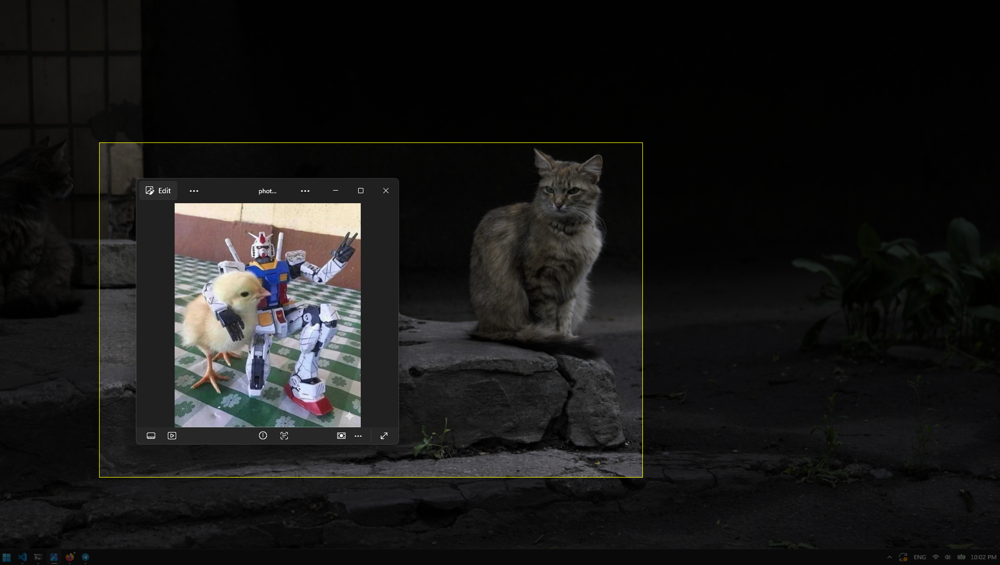

# screenshot

A screenshot application for Windows

`Alt+Shift+P` - To open the screenshot window

`Ctrl+C` - To copy the screenshot to the clipboard

# TODO

1. Save screenshots as png with `Ctrl+S`
2. Resizing the selected area
3. Ability to change hotkey without changing code and recompiling the program
4. Quick screenshot (copy screenshot without waiting for user `Ctrl+C`)